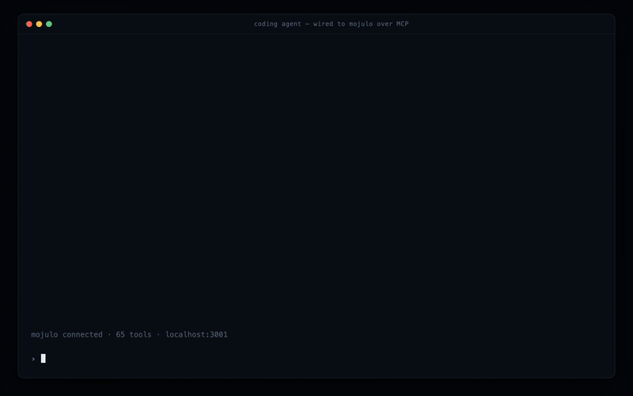

# Mojulo

[](https://www.npmjs.com/package/mojulo)
[](LICENSE)
[](control/package.json)


Mojulo is a **3D compiler for coding agents**: a local MCP server where the agent you already run (Claude Code, Codex, any MCP host) builds objects, walkable worlds and games by conversation, and what gets stored is source, not a mesh. Every artifact is a small deterministic **recipe** on your own disk: a few hundred bytes of JSON, or an OpenSCAD program, that a kernel compiles back to the same geometry on every read, byte for byte, and that emits to Godot, Blender, Unity, Unreal, glTF, OpenUSD, or print-ready STL / 3MF at true scale. A compiler, not a generator: you edit and diff the recipe like code, and renders are disposable. No API key, no account, no telemetry. Your agent does the thinking; mojulo holds the state and does the geometry.

## Quickstart

```bash
npx mojulo init
```

Needs **Node 22.12+** and an MCP-capable coding agent (Claude Code or Codex; Claude Desktop works too). `init` finds the hosts on your machine, asks once per host, and opens the dashboard at `http://localhost:3001`. Everything lands in `~/.mojulo/`. Then open a fresh agent session and ask: **"what is this?"**

The first install is the big one: npx pulls a ~27 MB tarball whose native dependencies land at about 590 MB on disk (measured on the unreleased tree; 2.0.6 measured 885 MB before the local search model and its runtime became the opt-in `mojulo install recall`, and `semantic_search` ranks lexically without them). Most of the rest is `puppeteer-core` (local headless Chrome for stills) and `better-sqlite3`. Nothing in the list reaches the network on its own; the per-dependency sheet is in [docs/tech-requirements.md](docs/tech-requirements.md). Verified on macOS (Apple Silicon); Linux runs the test suite in CI, and a CLI-only run of 2.0.6 from a Linux x64 sandbox (Node 24, no browser) minted a city and exported it; Windows was verified natively under Claude Code.

<details>
<summary>Wire it by hand instead</summary>

```bash
# Claude Code (--scope user makes mojulo available in every project):
claude mcp add --scope user mojulo -- npx -y mojulo

# Codex: add to ~/.codex/config.toml
[mcp_servers.mojulo]
command = "npx"
args = ["-y", "mojulo"]
```

```jsonc
// Claude Desktop: add under "mcpServers" in claude_desktop_config.json, then restart.
// If it fails with "spawn npx ENOENT", replace "npx" with the absolute path from `which npx`.
"mojulo": { "command": "npx", "args": ["-y", "mojulo"] }
```

Open the dashboard on its own with `npx -y -p mojulo mojulo-ui`. The same bin is a CLI over the tool registry: `npx mojulo tools`, `npx mojulo help mint_solid`, `npx mojulo call version`.

</details>

---

## Six things to say to it

Each one is a sentence to your agent, the tool it reaches for, and the recipe that gets stored. Every example below runs keyless and offline.

### 1. "Make me a coffee mug, 90 mm tall"

The agent calls `mint_solid { kind: 'workbench' }`. This is the whole stored recipe: a lathe for the body, a sweep for the handle, real centimetres.

```json
{ "units": "cm",
  "lathes": [ { "axisFrom": { "x": 0, "y": 0, "z": 0 }, "axisTo": { "x": 0, "y": 0, "z": 9 },
                "profile": [ { "t": 0, "radius": 3.6 }, { "t": 0.15, "radius": 4 }, { "t": 1, "radius": 4 } ],
                "tint": "#b8342c", "material": "satin" } ],
  "sweeps": [ { "path": [ [3.8, 0, 2.2], [6.2, 0, 3.2], [6.6, 0, 5.2], [5.4, 0, 7.0], [3.8, 0, 7.4] ],
                "radius": 0.6, "tint": "#b8342c", "material": "satin" } ] }
```

It is served shaded and turnable at `/sketches/<ref>`, and the same ref downloads as `model.stl` or `model.3mf` at 90 mm tall, z-up, slicer-ready. "Make the handle thicker" is `update_sketch` setting one `radius`; nothing is re-minted. `measure_solid` reads wall thickness, overhangs and closure off the recipe before you print, and if a slicer is installed the print gate stamps layers, time and filament beside the file. A bore through the body is a `cuts` line naming the body and the sweep that bores it; `exact: true` on that line composes it with Manifold instead of the sampled grid, so the lip is a true circle and a 40 mm disc measures 40, in the viewer, the `.glb` and the print.

### 2. "Write me a Raspberry Pi 4 case tray in OpenSCAD"

The agent calls `mint_solid { kind: 'scad' }` and the program is the recipe, stored verbatim:

```openscad
board_w = 85; board_d = 56; clear = 1; wall = 2; floor_t = 2; wall_h = 12;
holes = [[3.5, 3.5], [61.5, 3.5], [3.5, 52.5], [61.5, 52.5]];   // the Pi's M2.5 pattern
module rounded_box(w, d, h, r) { hull() for (x = [r, w - r], y = [r, d - r]) translate([x, y, 0]) cylinder(r = r, h = h, $fn = 48); }
module tray() {
  color("#3a3f4b") difference() {
    rounded_box(board_w + 2 * (clear + wall), board_d + 2 * (clear + wall), floor_t + wall_h, 3);
    translate([wall, wall, floor_t]) rounded_box(board_w + 2 * clear, board_d + 2 * clear, wall_h + 1, 1.5);
    translate([board_w + 2 * clear + wall - 1, wall + 2, floor_t + 3]) cube([wall + 2, board_d + 2 * clear - 4, wall_h]);   // USB / Ethernet
    translate([wall + clear + 5, -1, floor_t + 3]) cube([55, wall + 2, wall_h]);                                            // USB-C, HDMI, audio
  }
}
module standoffs() {
  color("#c9a227") for (p = holes) translate([wall + clear + p[0], wall + clear + p[1], floor_t])
    difference() { cylinder(d = 6, h = 3, $fn = 32); translate([0, 0, -1]) cylinder(d = 2.5, h = 5, $fn = 24); }
}
```

with `parts: { tray: 'tray();', standoffs: 'standoffs();' }`. OpenSCAD itself meshes it on every read, in-process as WebAssembly with the Manifold backend, so booleans are exact and every edge is sharp. `color()` is the tint; each named part is a render group a hinge in `movers` can swing. The same ref serves the orbit view, the `.glb`, the engine packs and `model.stl` at 91 × 62 × 14 mm as written; `model.scad` hands the source back unchanged. Change `wall_h` with `update_sketch` and the readout names the one part that moved. For what OpenSCAD cannot say, a blended join, a stroked dent, seeded noise, the source calls `mojulo_field("<id>")` and a field solid from the same recipe is baked in at that spot.

### 3. "Build a 20 by 24 ft living room with a door on the south wall"

That is the GIF at the top. The agent calls `create_sketch { kind: 'floorplan' }` and stores this:

```json
{ "kind": "floorplan", "width": 24, "height": 28,
  "rooms": [ { "x": 2, "y": 2, "w": 20, "h": 24, "glyph": "L" } ],
  "doors": [ { "x": 12, "y": 26, "room": 0, "edge": "S" } ],
  "furnish": true, "view": "cutaway", "seed": 7 }
```

The `L` glyph and the seed furnish it: sofa, two chairs, rug, lamp, windows. "Add pot lights to the ceiling" adds `"potLights": true` and nothing else changes. `"levels": [...]` stacks it into a building with stairs through the slabs. The same recipe walks in the browser at `/world`, exports as a `.glb`, or goes to Blender as an art-pass pack, where a Cycles bake can write traced light back into the mesh's own vertex colours so the lit result runs anywhere at zero runtime cost.

### 4. "Generate a 3D city at night"

The agent calls `compose_world { base: 'city', seed: 42, overrides: { context: { time: 'night', locale: 'east-asia' }, asset: { anchor: 'tower' }, fog: true } }`. The whole city is a pure function of the seed: change it for a new city, keep it and the same city regrows on any machine. Open the `/scene` URL for a dependency-free CSS-3D render, or `/world` to walk it with WASD. Bases besides `city`: a transport hub, a K-12 campus, a torch-lit dungeon, a planetary body, a painted landscape, a walkable Cayley graph of a finite group.

### 5. "Make it walkable, then make it a game, then export it for Godot"

`compose_world { base: 'controllable' }` gives a live world you drive. Adding `game: { mechanics: [...] }` to a world makes it a level: reach the exit, survive twenty seconds, collect the relay core. `create_game` binds levels, a synthesized score and figures into one playable artifact with a typed store (inventory, party, flags) that carries between levels; every level must pass a contract dry-run and a traversal that reached the win condition before the game mints. `export_game { target: 'godot' }` writes a real Godot 4 project you open and extend. Unity and Unreal get the same data pack plus an importer; the worked Unreal example is [docs/examples/unreal-night-run/](docs/examples/unreal-night-run/).

### 6. "Create a snowman with a top hat"



`mint_solid` as a part graph: three snowballs, a brimmed hat, twig arms, a carrot nose, coal buttons, a scarf, each part placed by relation to its parent rather than by coordinates. Coloration iterates in place on the same ref. Same doors out: HTML viewer, `.glb`, `.stl`.

**Also from a sentence:** a posed human figure or an animal mid-stride, rigged for glTF or VRM; a six-storey building with a set-back penthouse; an ambient loop or a full score synthesized from seeded math with no samples; a room's layout recovered from a photo you show your agent. The full catalog is in [docs/tour.md](docs/tour.md).

---

## Where it goes

One recipe, several targets, all off the same ref: `/api/sketches/<ref>/{svg,scene,world,model.glb,model.stl,model.3mf,model.usdz,model.scad}`. Each URL regenerates deterministically on request — geometry byte for byte across platforms; an embedded texture PNG can differ in its compressed bytes while its pixels do not — and every handoff carries a ledger naming what did not travel.

| Target | What you get | The gate |
|---|---|---|
| **Browser** | A still SVG, a dependency-free CSS-3D scene, a walkable WebGL world. | Your eyes. |
| **`.glb` / OpenUSD** | glTF with lighting baked into vertex colours (or `lit` for PBR), rig clips, skinned meshes, VRM bone names; `usda` / `usdz` at true scale. | Blender and `usdcat`, when installed. |
| **Godot** (first-class) | A real Godot 4 project: `project.godot`, the versioned kernel scripts, the GLB, export presets. | Headless import and a one-frame run, when `MOJULO_GODOT` names the binary. |
| **Unity / Unreal** (gated legs) | A data pack plus a C# editor importer or a Python importer; game packs add a C++ kernel plugin. | A scratch project imported headless, when `MOJULO_UNITY` / `MOJULO_UNREAL` name the editor. |
| **Blender** (art pass) | An art-pass pack with importer scripts, and a Cycles bake of global illumination back into vertex colours. | The importer run headless, when `MOJULO_BLENDER` names the binary. |
| **STL / 3MF** | Print-ready at true scale: mm, z-up, colours and instanced repeats in 3MF, process-aware advisories (FDM, SLA, SLS, MJF). | A local slicer run over the 3MF, stamping layers, time and filament. PrusaSlicer and Bambu Studio verified. |
| **`.scad`** | A program, not a mesh. A `scad` recipe returns its own source verbatim; a workbench recipe is transpiled term by term into OpenSCAD solids and booleans, with a coverage ledger naming any term that arrived as a frozen `polyhedron()`. | OpenSCAD re-renders it and checks size and volume against the recipe, when the binary is installed. |

Every export works with nothing installed; the pack is written and the gate reports "skipped" with the reason. Installing the engine adds the machine gate. Gates advise and stamp, none refuse, and no gate ever claims a human looked. Doctrine: [docs/bicycles.md](docs/bicycles.md).

---

## What stays on your machine

- **Recipes** live in one SQLite file at `~/.mojulo/mojulo-lite.db`. Renders are derived and disposable.
- **Your cookbook.** `save_recipe` promotes a recipe to `~/.mojulo/data/cookbook`, plain `card.md` + `recipe.json` folders in a local git repo with no remote, recallable by intent months later through `semantic_search`. The public [mojulo-recipe-book](https://github.com/zombico/mojulo-recipe-book) is the same format: clone it, point `MOJULO_RECIPE_BOOK` at it, and it adds chapters and whole new kinds without touching core.
- **Exports** are plain files you open in anything. Provider keys, if you ever save one, are AES-256-GCM encrypted at rest.
- **No telemetry, no phone-home.** Outbound traffic is npm at install, a few one-time lazy downloads on first use (the embedding model, a browser if you have none, ffmpeg, geo data), and an update check when your agent asks for one. Full list: [docs/tech-requirements.md](docs/tech-requirements.md#network-posture).

The control plane is single-operator and localhost-only by default. The stdio MCP has no network surface; the HTTP MCP route 404s unless `CONTROL_PLANE_MCP_KEY` is set. Don't expose it to the public internet; use a tunnel or Tailscale if you need it remote. Threat model: [SECURITY.md](SECURITY.md). Terms and the operator-owns-consequences posture: [TERMS.md](TERMS.md), [docs/responsibility-model.md](docs/responsibility-model.md). The open-source mojulo is and stays Apache-2.0 with no telemetry; if a hosted mojulo cloud is ever explored, it would be its own opt-in product and the local install would not change or depend on it.

---

## How it works

A Next.js app exposes two faces over one SQLite: an MCP server (stdio for the npm package, HTTP for remote clients) that your agent calls, and a dashboard at `localhost:3001` that renders what accumulates. The compiler shape: a recipe is the source (params plus a `kind`), a kernel is the backend that regenerates it on every read, and each emitter is a target that owns its own frame and unit conversion from the native z-up metre frame. A kernel's output for given params is a compatibility promise over already-minted rows, tested byte-for-byte. Optional local workers (Blender, slicers, mesh sculptors, ComfyUI, Kokoro) are operator-hosted and never dependencies; absence degrades one loop without breaking any.

Also in the box, present by default and never in the way: diagrams and charts, directed images an external model paints, publications and research notebooks, local apps whose inference parks back on your agent, and workflows over the MCPs you already run. The chatbot factory is an opt-in pack (`mojulo install chatbot`) and is the one artifact that needs an LLM key of its own.

- [docs/tour.md](docs/tour.md) — the long tour: everything mojulo makes and who it is for
- [docs/AGENT-REFERENCE.md](docs/AGENT-REFERENCE.md) — the substrate, rings, data layout, daemons
- [docs/MCP-ARCHITECTURE.md](docs/MCP-ARCHITECTURE.md) — transport, session binding, deliberation surfaces
- [docs/POLYGONIZER-SYNTHESIS.md](docs/POLYGONIZER-SYNTHESIS.md) — the geometry substrate
- [docs/tech-requirements.md](docs/tech-requirements.md) — measured footprint, engine legs, slicers, workers, platform notes
- [docs/local-blender-worker.md](docs/local-blender-worker.md), [docs/local-slicer-worker.md](docs/local-slicer-worker.md), [docs/local-mesh-worker.md](docs/local-mesh-worker.md), [docs/local-image-worker.md](docs/local-image-worker.md) — the optional workers
- [AGENTS.md](AGENTS.md) — for non-Claude hosts; [docs/chatbot/](docs/chatbot/) — the optional pack

```
mojulo/
├── control/        Next.js control plane: MCP server, dashboard, kernels, emitters, runtime supervisor
├── lite-template/  Runtime for the optional chatbot pack
└── docs/           Concept docs
```

## Contributing

One maintainer, no SLA. The wide door is the [recipe book](https://github.com/zombico/mojulo-recipe-book): a folder with a card and a recipe, or a pure builder for a whole new kind, needs no change here. In core, bug reports with a pasted recipe (they reproduce exactly), correctness fixes, translations and tests are welcome; concept PRs that change how mojulo works will likely sit, and forks are the open door. Straight up: the maintainer is one person and most read passes are AI-assisted. Full stance and the open requests: [CONTRIBUTING.md](CONTRIBUTING.md).

## License

[Apache License 2.0](LICENSE)
