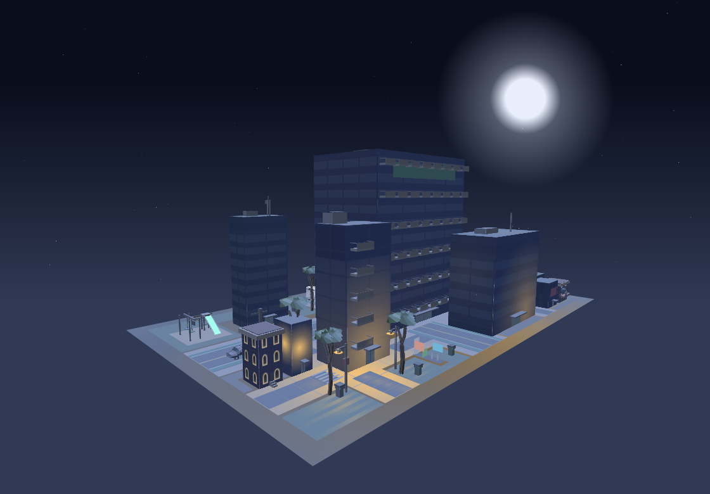
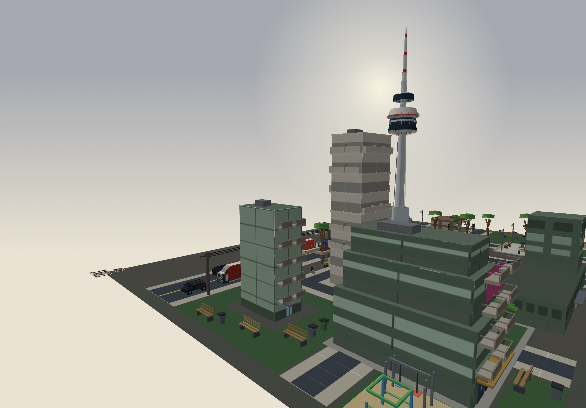

# Mojulo

[](https://www.npmjs.com/package/mojulo)
[](LICENSE)
[](package.json)

**Mojulo is general-purpose personal computing for the age of agents** — local, yours, and not a hosted service. Your agent (Claude Code, Codex) does the reasoning; mojulo is the machine it works in, where bots, apps, workflows, publications, and worlds accumulate as things you own.

It runs on your laptop. It doesn't host inference — the reasoning bill stays on your existing Claude or ChatGPT subscription. Nothing here is a subscription you rent from us or a cloud you feed: what your agent makes lives on your disk and outlives the chat.

The range is the point. The same workshop does **front-desk AI work** (deployable chatbots with tamper-evident transcripts), mints **live science explainers**, composes **synthesized music**, and builds **playable games** — and everything it makes is a tiny deterministic **recipe**: small enough to read, seeded to regenerate identically, yours to edit a line at a time.

**Install:** `npx mojulo init` — detects Claude Code / Codex, wires mojulo in, opens the dashboard. No API key needed for most of it. [Quickstart ↓](#quickstart)



<sub>One of the worlds your agent composes from primitives — rendered without a game engine, served as a plain HTML scene. The workshop makes bots, apps, services, publications, and worlds; this is a world. See [Worlds &amp; visuals](#worlds--visuals).</sub>

---

## What you can build

The dashboard at `localhost:3001` is a shelf of bays. Your agent fills them:

- **Bots** — chatbots compiled into a runnable `<bot>.zip`. Hash-chained transcripts, offline multilingual RAG, embeddable widget. Run locally with `docker compose`, deploy to Fly, or run air-gapped.
- **Apps** — local apps each with their own MCP sidecar. Scaffold from a template, the runtime supervises the process, your agent talks to the sidecar.
- **Connected Services** — workflows over the MCPs you already have (Drive, Gmail, Linear, your CRM). Either as agent-side skills synthesized from catalysts, or as composed mcp-orbit chains.
- **Outputs (Cooks)** — typed publications materialized from stashed inputs: briefs, essays, decks, resumes, newsletters, comics, picture books, whole static sites.
- **Sketches & worlds** — the visual bay. Two-dimensional diagrams (flowcharts, stacked bars, donuts, KPI tiles, decision diamonds via `create_sketch`) *and* generative 3D: cities, posed figures, painted landscapes, carved wordmarks, transit hubs, everyday objects, and drivable worlds. One geometry spec renders as an SVG, a dependency-free CSS-3D scene, a traversable WebGL world, or a `.glb`. Minted by your agent, served under `/sketches/<ref>`. See [Worlds & visuals](#worlds--visuals).
- **Games & arcade** — playable artifacts. Arcade cabinets compile to a single HTML file (a pure reducer, the skin, and a score synthesized in-page); composed games bind worlds, music, and machines by ref — and a level can't mint unless a compiled traversal proves it completable.
- **Beats** — synthesized musical artifacts: ambient loops, grooves, compositions — pure math and seeded dice, never samples. Worlds opt in to soundtracks, SFX cues, and footsteps; a score exports as WAV or MIDI.
- **Maker** — the visual workbench. Browse and compose the illustrations, worlds, and motion your agent mints — where the `create_*` visual family and `forge_motion` land.
- **Plans** — the deliberation surface. Goals get framed, scoped, and tracked from draft to executed.
- **Research** — a notebook that accumulates sources, snippets, screenshots, abstracts. Searchable across everything captured.
- **Stashes** — typed buckets and drawers. The agent files inputs here; cooks pull from them.

Plus **Settings** for host config. The reasoning happens in your agent; mojulo persists state, supervises processes, and renders the shelf.

---

## Quickstart

You need **Claude Code** or **Codex** installed. You do **not** need an LLM
provider key for most of mojulo — your agent is the reasoning loop, so sketches,
worlds, cooks, research, and apps all run keyless. The one thing that needs a key
is a **bot**: a compiled bot is a chatbot that calls an LLM on its own, and
building one generates a few pieces (form schema, identity, summary) server-side.

```bash
npx mojulo init
```

`init` detects your MCP host(s), wires mojulo into each (one yes/no per host),
*optionally* offers to set a provider key, and opens the dashboard at
`http://localhost:3001`. Nothing is sent anywhere; state lands in `~/.mojulo/`.

### First look — no key required

Back in your agent, try these in order. They render locally and hand you a URL:

```
what is this?                  → forward_context: mojulo orients itself, out loud
generate a 3D city             → compose_world (base: city) → open the /scene URL
make me a walkable world       → compose_world (base: controllable) → drive it at /world
```

The first prompt is the one to watch: your agent reads mojulo's own routing
index (`forward_context`) to decide what to do. That's the substrate explaining
itself — no key, no cloud call, no bot yet.

### Everything else, keyless

Because your agent is the reasoning loop, most of mojulo needs no provider key —
your agent authors the content and mojulo materializes it:

```
draft a one-page brief on X          → a cook (your agent writes it)
research W and synthesize what I find → the research notebook
spin up a local app for Z            → app inference parks back on your agent
```

### When you're ready to build a bot

A compiled bot calls an LLM to run, and the builder generates a few pieces
(form schema, identity, summary) server-side — so **bots** need at least one
provider key (via `init`, the dashboard's Settings, or the CLI):

```bash
npx -y -p mojulo mojulo-config set anthropic sk-ant-...
```

Then:

```
build me a triage bot for my dental practice
```

Mojulo's tools self-route — your agent picks the right entry point.

### When you want painted images

Mojulo's directed-images loop *designs* pictures — composition-locked scaffolds — but painting one takes an image model, and **Claude doesn't generate images**: Claude Code has no native image capability, so with Claude alone the loop stops at the scaffold. Two ways to add the painter:

- **An image-capable agent.** Codex or an image-capable ChatGPT plan paints the scaffold directly — nothing to install.
- **The local image worker.** A self-hosted ComfyUI + Qwen backend, installed from a checkout of this repo (the models are ~31 GB and are not part of the npm package):

```bash
control/scripts/install-local-imagegen.sh          # ComfyUI + Qwen-Image-Edit + Lightning LoRA (~31GB)
control/scripts/install-local-imagegen.sh --gguf   # + the Q6_K quant — use this on Apple Silicon / lower RAM
cd ~/mojulo-imagegen/ComfyUI && source venv/bin/activate
python main.py --listen 127.0.0.1 --port 8188      # loopback only — ComfyUI has no auth layer
```

On Apple Silicon, run with the GGUF quant — the fp8 checkpoint hits an MPS dtype error. Everything else in mojulo works without any of this, and the scaffold recipes stay sovereign either way: install the painter later and every staged picture becomes paintable retroactively. See [docs/local-image-worker.md](docs/local-image-worker.md).

### Manual wiring (if you prefer)

If you'd rather not run the installer, wire mojulo into your agent directly:

```bash
# Claude Code / Claude Desktop:
claude mcp add mojulo --command "npx -y mojulo"

# Codex: add to ~/.codex/config.toml
[mcp_servers.mojulo]
command = "npx"
args = ["-y", "mojulo"]
```

Open the dashboard separately anytime with `npx -y -p mojulo mojulo-ui`.

---

## What stays on your machine

- **Workshop state.** SQLite at `~/.mojulo/mojulo-lite.db`. Plans, research, stashes, sketches, cooks, deployment registry.
- **Bot transcripts.** Every bot you compile has its *own* SQLite. The control plane stores only `url` + `last_seen_at`; transcripts are read live through a bearer-authenticated proxy.
- **Encryption / keys.** Provider keys AES-256-GCM encrypted at rest.

No telemetry. No phone-home. The only outbound traffic is what your agent and the bots/cooks you build explicitly initiate.

---

## How it works

The control plane is a Next.js app exposing two surfaces over the same encrypted state:

- **MCP** (stdio for the npm package, HTTP for remote clients) — what your agent calls.
- **Dashboard** at `localhost:3001` — what you look at.

Your agent calls mojulo's tools via MCP; the tools mutate state in `~/.mojulo/`; the dashboard renders that state. Bot and app runtimes are supervised by a daemon the control plane manages.

When your agent first connects, it calls `forward_context` to read mojulo's concept glossary, lifecycle, and tool index — so the session orients itself before doing anything destructive. Host adapters (`claude-code`, `codex`, `generic`) are auto-resolved from the connecting client; non-Claude agents should also read [AGENTS.md](AGENTS.md).

---

## Bots in particular

The Bots bay is the most mature and has the deepest feature set:

- **Five protocols ship** — `knowledge` (in-process RAG), `formGathering` (structured field capture, PII bypasses the LLM), `appointments`, `triage` (cross-bot routing), `opticalRead` (vision-based extraction).
- **Hash-chained transcripts.** Every turn is content-hashed and chain-linked; `/verify/:id` walks the chain. Chains continue across triage handoffs. Image-extraction turns hash over the image bytes, so post-hoc edits to the source image break the chain. See [docs/turn-hashing.md](docs/turn-hashing.md).
- **Multilingual vector RAG, fully offline at runtime.** `multilingual-e5-small` ONNX baked into the bot image. Cross-language retrieval works without language detection or an embedding-API key. See [docs/vector-rag.md](docs/vector-rag.md).
- **PII bypass.** Locale-aware structured fields render client-side and submit through a dedicated endpoint that doesn't call the model. Transcript records only an opaque marker like `{contact_form_filled}`.
- **Image extraction with hashed inputs.** Name the slots you want out of an uploaded image (DOB, license #, expiry, prescription dose); a vision-capable LLM reads it, the user reviews before submit.
- **20-locale UI.** Chat widget and form errors render in the user's language without operator configuration.
- **Multiple LLM providers.** OpenAI, Anthropic, or local Ollama. Pick at build time, swap by editing `.env`.
- **Embeddable widget, Prometheus metrics, form-submission webhooks.**

Conversation data never leaves the bot. The control plane reads it through a proxy that doesn't copy.

---

## Worlds & visuals

The Sketches bay isn't just charts. The same `create_*` family your agent calls to draw a flowchart also composes generative 3D — geometry built from primitives on your machine, no image model, no cloud render, **no provider key**:



- **Cities & structures** — `compose_world` (base `city` for a recursive skyline; base `transport-hub` for an airport / station / subway), `create_manji_tree` (cardinal-grammar structural illustration).
- **Figures** — `create_figure` poses a human body: male or female, stances, a reach, a walking gait.
- **Objects & marks** — `create_workbench` blocks out an everyday object at literal scale (candlestick, lamp, dumbbell); `create_carved_solid` extrudes a metal or beveled wordmark, logo, or badge.
- **Landscapes** — `compose_world` (base `painted-landscape`) composes a painterly scene from sky / palette / geometry glyphs.
- **Drivable worlds** — `compose_world` (base `controllable`) builds a world you can walk or fly through, with the camera and entities as first-class primitives.
- **Study objects** — `create_view` mints an animated science / math / bio explainer (nuclear fission, the double-slit experiment, a derivative, DNA) from one `kind` + a few knobs — 45 kinds behind one tool.
- **Directed images** — an `image-outcome` recipe stages a composition-locked scaffold that an external image model paints: your agent's own image capability, or an optional local ComfyUI + Qwen worker. The design stays sovereign; the painted render binds back with provenance. See [docs/local-image-worker.md](docs/local-image-worker.md).
- **Motion** — `forge_motion` puts any of the above in motion: a turntable, an orbit, a fly-through, or a paced concept explainer, rendered to a shareable GIF (clips stitch into an MP4).

The distinctive part is the render pipeline: **one geometry spec, several targets.** The same world serves as a still (SVG, or a dependency-free CSS-3D `preserve-3d` scene — a real 3D view in a plain HTML file, no WebGL and no build step), a **traversable** WebGL world you walk with WASD, a `.glb` you export into Blender or Unreal, or a printable `.stl` — all off a single minted ref at `/api/sketches/<ref>/{svg,scene,world,model.glb,model.stl}`. The chat ends; the city doesn't; it can leave the screen entirely.

Because it's deterministic geometry, the first render costs nothing but the render — this is the keyless first look in the [Quickstart](#quickstart). And live *rule-driven* worlds are no longer a further layer: they shipped as **games** — a shell owning a typed store, levels that are worlds carrying a `game:` contract, and a completability audit at mint. See the Games & arcade bay above.

---

## Deploy options for compiled bots

Bots are the only bay with cloud deploy targets — the other bays run on your machine.

### Locally (default)

```bash
unzip my-bot-{id}.zip && cd my-bot-{id}
# paste LLM key into .env
docker compose up
```

### Fly.io

Configure a Fly token (paste in **Settings → Provider Keys** or `npx -y -p mojulo mojulo-config set fly fo1_...`), then deploy from the dashboard or ask your agent. Persistent volume, autostart on request, autostop when idle. No `flyctl` install required. Your Fly account, your bill.

### Air-gapped / your own registry

Set `MOJULO_OFFLINE_BUILD=1` on the control plane. The artifact bundles full source + Dockerfile and builds locally on the target machine.

To point the prebuilt path at your own registry:

```bash
BOT_IMAGE=ghcr.io/your-org/your-bot:0.1.0           # control plane local build
MOJULO_CLOUD_IMAGE=ghcr.io/your-org/your-bot:0.1.0  # Fly cloud deploy
```

---

## Security & deployment posture

The control plane is **single-user, self-hosted, localhost-only by default**. Two access-control affordances, both opt-in:

- **HTTP login** (for the dashboard UI). Set `CONTROL_PLANE_USER` + `CONTROL_PLANE_PASSWORD` in `control/.env`. Sessions are HMAC-signed with the password itself, so rotating it invalidates every outstanding session. Intentionally minimal — no MFA, no lockout, no multi-user.
- **MCP bearer token** (for HTTP MCP). Set `CONTROL_PLANE_MCP_KEY` to enable `/api/mcp`; with the key unset, the route 404s. The stdio transport (`npx -y mojulo`) is local-only and doesn't use this key.

**Network posture:** don't expose the control plane to the public internet. Pick whichever fits:

- **localhost** (the default).
- **Tailscale / WireGuard / VPN.**
- **SSH tunnel.** `ssh -L 3001:localhost:3001 your-host`.
- **Reverse proxy with auth.** Caddy, nginx, Traefik with basic auth — or OAuth2 Proxy, Cloudflare Access, Authelia, Tailscale Funnel.

**The bots it compiles have a different posture** — they're designed to face end users. The control plane → bot proxy is authenticated by a shared `MOJULO_API_KEY` baked into the artifact at build time. See [SECURITY.md](SECURITY.md) for the threat model.

---

## Audit chain posture

The per-turn hash chain (`content_hash` + `chain_hash`, walked by `/verify/:id`) is **tamper-evident, not tamper-proof**. It catches naive retroactive edits to the bot's SQLite — change one row, the chain breaks at every row after it. It does **not** stop a sophisticated operator with DB access from rebuilding a coherent forged history; there is no signing key and no external anchor.

If your threat model demands non-repudiation against the bot operator themselves, you need an external anchor (RFC 3161 timestamping, OpenTimestamps, an external witness server). None are shipped today; the federated-routing handoff is the existing surface where a pluggable witness sink would land. See [docs/turn-hashing.md](docs/turn-hashing.md).

---

## Responsibility model

Mojulo runs on your machine, on your credentials, driven by your agent. There is no hosted service, no telemetry, no remote kill switch — which means the operator (you) is the only party in the system with the context to evaluate intent, capability, and suitability for any given use. The terms of use formalize that posture; the architecture is what makes it true.

- [TERMS.md](TERMS.md) — terms of use.
- [docs/responsibility-model.md](docs/responsibility-model.md) — the architectural reasoning behind those terms.

If you're using mojulo in a regulated industry, with restricted data, or in a safety-critical setting, read both before you proceed.

---

## Why

Software keeps drifting toward hosted services — tools you rent by the month, run in someone else's cloud, and pour your data into. Handy, until you notice you own none of it and none of it runs without them. Mojulo is the other bet: **general-purpose computing you own.** Your agent is the new interface; your machine is still the substrate; the things you make are still yours.

- **Your subscription is the bill.** Mojulo doesn't host inference. Your Claude or ChatGPT subscription does the reasoning; mojulo just composes the outputs.
- **Your machine is the substrate.** Everything runs on localhost. State lives in `~/.mojulo/`. No SaaS account to manage, no tenant boundary to leak across.
- **Your agent is the interface.** The dashboard is a shelf, not a chat window. You drive mojulo by talking to Claude Code or Codex — the same agent you already use for everything else.
- **Your artifacts are yours.** Compiled bots are zips. Cooks are documents. Apps are local processes. Sketches are SVGs. Nothing is locked to mojulo's runtime.

---

## Who builds with this

A spectrum, all driving the same open-source, self-hosted stack from their own MCP-capable agent:

- **Indie makers** vibe-coding side projects without a SaaS bill — a chatbot for a friend, a weekly newsletter cook, a local app for a personal workflow.
- **Agencies & implementers** building per-client bots and workflow compositions — deliverables the client keeps and regenerates, with provider and locale swapped per project.
- **Internal IT** rolling out air-gapped helpers inside firewalled networks — offline RAG means no embedding API to allow-list.
- **Regulated SMBs** — clinics, law offices, financial pre-screen — where the tamper-evident transcript provides an internal audit trail.
- **Anyone with a Claude/ChatGPT subscription** who wants their agent to ship more than chat transcripts.

---

## Architecture in one paragraph

The control plane is a Next.js app exposing both a dashboard and an MCP server (stdio for the npm package, HTTP for remote clients). Workshop state — plans, research, stashes, sketches, cooks, deployment registry — lives in a single SQLite under `~/.mojulo/`. Bot/app runtimes are separate processes supervised by a daemon. Builder tools — driven from your agent over MCP or from the in-app chat builder / wizard — produce deployment configs that compile to per-bot zips: protocol cartridges composed into `instructions.txt`, documents + triage routes baked into an `embeddings.json` vector index. The runtime is a separate Express container ([lite-template/](lite-template/)) published to GHCR — pull it, mount the per-bot config, you have a bot. Cloud deploys go to Fly Machines, injecting the same config files via the Machines API. The dashboard reads bot conversations live through a bearer-authenticated proxy — transcript rows never get replicated into the control-plane DB.

Full diagrams: [docs/BOT-ARCHITECTURE.md](docs/BOT-ARCHITECTURE.md) (bot factory + artifact lifecycle), [docs/MCP-ARCHITECTURE.md](docs/MCP-ARCHITECTURE.md) (headless control surface).

---

## Repo layout

```
mojulo/
├── control/        Next.js control plane: MCP server, dashboard, builders, deploy pipeline, runtime supervisor
├── lite-template/  The bot itself: Express server, RAG, LLM client, Dockerfile
└── docs/           Concept docs + BOT-ARCHITECTURE.md / MCP-ARCHITECTURE.md
```

Per-package docs: [control/README.md](control/README.md) — running the control plane in dev. [lite-template/](lite-template/) — bot runtime internals.

Concept docs (start with the first three):

- [docs/mojulo-bots.md](docs/mojulo-bots.md) — plain-language orientation to bots, protocols, and the control plane
- [docs/mcp-integration.md](docs/mcp-integration.md) — the MCP surface, the composition recipes, the session model
- [docs/catalysts.md](docs/catalysts.md) — what a catalyst is and how to author one
- [docs/meta-context.md](docs/meta-context.md), [docs/mcp-orbit.md](docs/mcp-orbit.md) — connected-services composition
- [docs/wizard-builder.md](docs/wizard-builder.md), [docs/chat-builder.md](docs/chat-builder.md) — the in-app build paths
- [docs/vector-rag.md](docs/vector-rag.md), [docs/turn-hashing.md](docs/turn-hashing.md), [docs/federated-routing.md](docs/federated-routing.md) — the artifact properties
- [docs/form-collection.md](docs/form-collection.md), [docs/optical-read.md](docs/optical-read.md), [docs/conversations-api.md](docs/conversations-api.md) — capture & read paths

---

## Contributing

**One maintainer, no SLA.** Issues and PRs are read, but triage and review can take days or weeks depending on what's already in flight — a non-trivial PR may sit until I've had time to catch up on the surfaces it touches. Opening an issue first, even for a one-line PR, is the fastest path to a decision: it lets the scope conversation happen before the code does.

The codebase is functionally modular but tightly integrated — a change to the envelope schema, the cartridge composer, a deployer, or the MCP tool surface touches multiple surfaces. That integration density is load-bearing for the artifact-portability and audit-chain guarantees, and it's also the reason contribution policy is channeled by surface rather than open across the board.

**Always welcome — open an issue:**
- Bug reports with a reproducer (especially RAG/locale/cartridge/MCP edge cases)
- Translation quality issues (any locale, any string)
- Documentation gaps or errors
- Questions about whether something should be a PR

**Accepted as PRs with the standard bar:**
- Bug fixes with a clear reproducer (for non-obvious bugs, file an issue first)
- Documentation fixes
- Locale string fixes
- Test additions that target the surfaces listed in [CONTRIBUTING.md](CONTRIBUTING.md#test-surface)

**Forking & extending the platform:**
- Custom protocols (your bot's specific behavior shape)
- New provider adapters
- Bespoke wizard flows or steps
- Custom catalysts that don't merit promotion to the canonical library
- Anything narrow to a client, vertical, or workflow

These belong in forks — the upstream repo stays abstract so the artifact format and audit guarantees stay stable. See [docs/protocol-composition.md#adding-a-new-protocol](docs/protocol-composition.md#adding-a-new-protocol) and [docs/catalysts.md](docs/catalysts.md).

Before opening a PR, read [docs/BOT-ARCHITECTURE.md](docs/BOT-ARCHITECTURE.md) and [docs/MCP-ARCHITECTURE.md](docs/MCP-ARCHITECTURE.md), and see [CONTRIBUTING.md](CONTRIBUTING.md).

## License

[Apache License 2.0](LICENSE)
