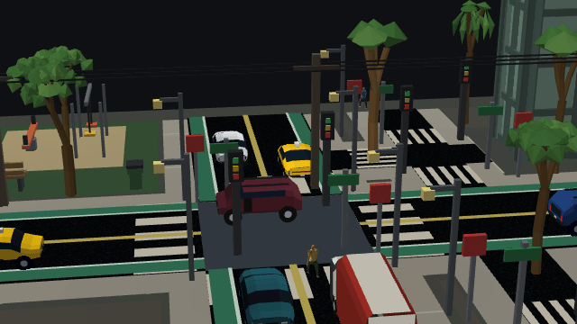
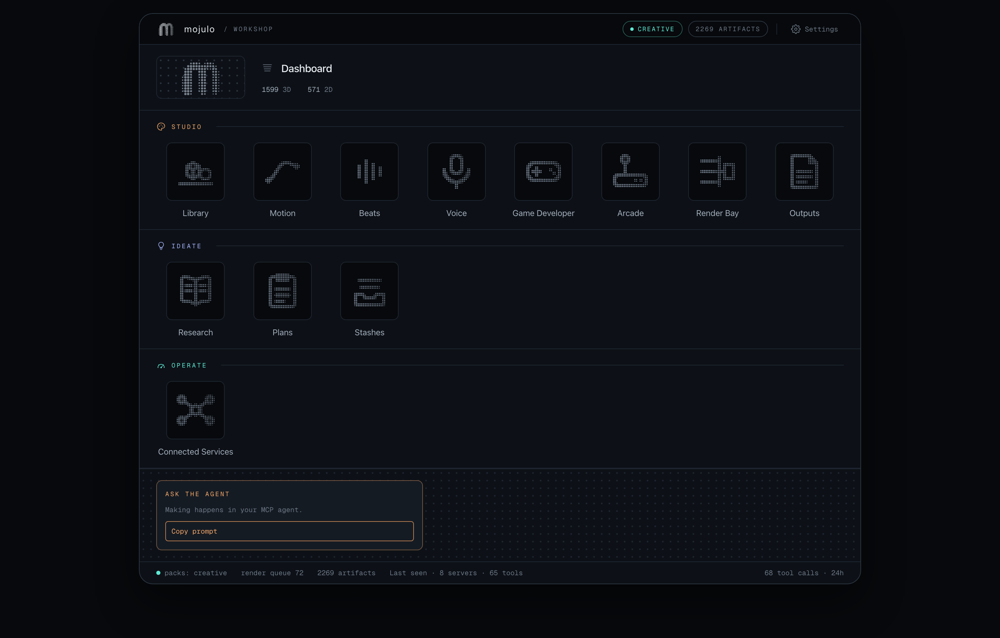
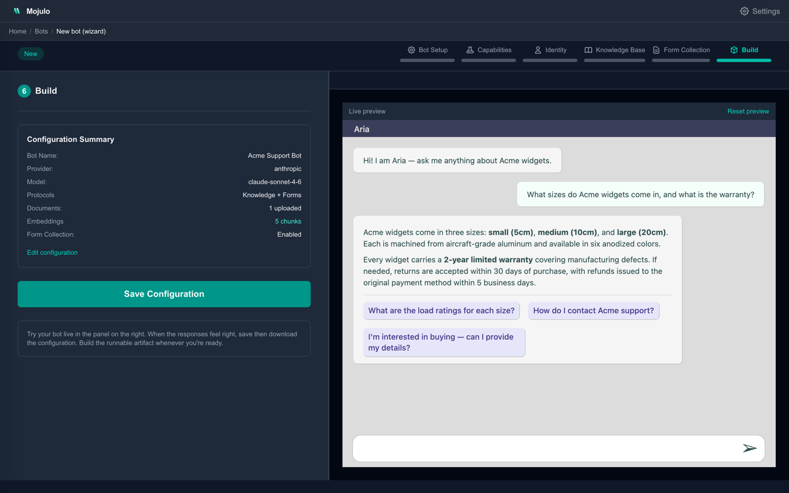
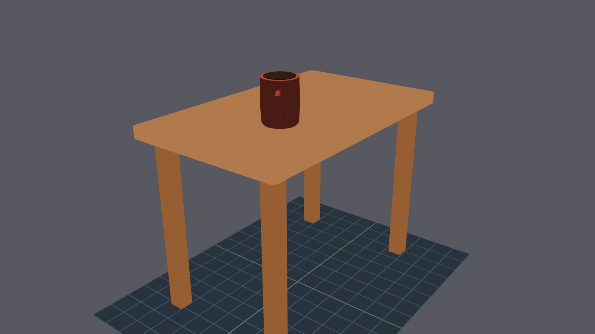
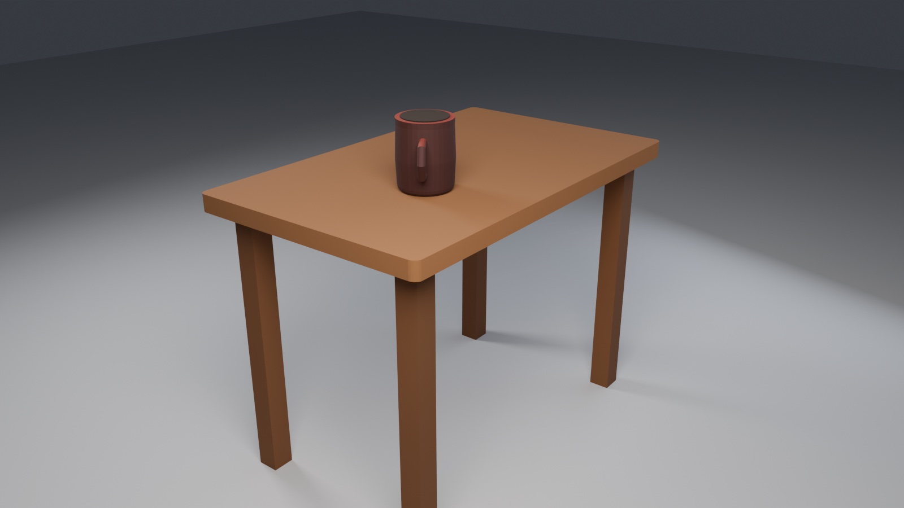

# Mojulo

[](https://www.npmjs.com/package/mojulo)
[](LICENSE)
[](package.json)

**Mojulo is a workshop for coding agents** — local, yours, not a hosted service. It turns the agent you already run (Claude Code, Codex) into a **chatbot factory**, a **services hub**, and a **3D & game studio**: you talk; the agent does the generating and the reasoning. Mojulo catches that output and sets it in a standard, owned form — a deterministic **recipe** on your own disk that regenerates identically and outlives the chat.

**The core — the chatbot factory and the services hub — is where that pays off first.** Your agent builds a **chatbot** — compiled to a runnable process with hash-chained transcripts and offline RAG — but the chatbot isn't the end of it. Its conversations lead to **outcomes**: wired through the MCPs and connected tooling already on your substrate (Drive, Gmail, your CRM), a conversation can book the appointment, file the record, send the brief. The bot is the front door; the connected tooling is what makes it *do* something.

**The creative wing is the 3D & game studio.** Your agent writes a geometry spec and mojulo renders it — an **object**, a **level**, a whole walkable **world** (dependency-free CSS-3D, WebGL, or `.glb`). Because each is the same kind of recipe, they **compose upward** into a playable **game**. And **sound comes free**: SFX and background music synthesized from pure math and seeded dice — no samples, no key — dropped straight into the game.

Underneath both wings is one move: mojulo pairs the coding agent's **generative capability** with a **standard file format**, and focuses it into an **artifact** you own. The agent writes the essay; mojulo pins it to clean HTML or Markdown. It designs a chart; mojulo emits SVG. It specs a world; mojulo bakes a `.glb`. What comes out is never a transcript to copy-paste — it's a standard file, in a format other tools already read, sitting on your disk. Apps, publications, research, diagrams — the rest of the shelf — all land the same way.

It runs on your laptop and doesn't host inference — the reasoning bill stays on your existing Claude or ChatGPT subscription. Everything lands in that same standard form, so the core and the creative wing compose and your agent is the one thing that composes across them — which is why it stays one substrate, not a suite you'd wire together yourself.

**Install:** `npx mojulo init` — detects Claude Code, Codex, or Claude Desktop, wires mojulo in, opens the dashboard. No API key needed for most of it. [Quickstart ↓](#quickstart)



<sub>One prompt: <i>"generate a 3D city with walkers and traffic."</i> Your agent mints a deterministic recipe (`kind: fractal-city, seed: 42` — that's most of it); mojulo renders it live with pedestrians and traffic simulated in-world. This clip is itself a recipe — a <code>forge_motion</code> camera shot over the stored world, re-bakeable frame-identically. The same ref serves a walkable WebGL world, a CSS-3D still, and a <code>.glb</code>. No key, no cloud render.</sub>



<sub>The workshop at `localhost:3001` — the shelf of bays your agent fills. The core lives under **Operate** (Bots, Connected Services, Apps); the creative wing under **Studio**. You drive it from the agent you already run; the dashboard renders what accumulates.</sub>

---

## What you can build

The dashboard at `localhost:3001` is a shelf of bays. Your agent fills them, grouped into its two halves — core and creative.

**Core — conversations that lead to outcomes.**

- **Bots** — chatbots compiled into a runnable `<bot>.zip`. Hash-chained transcripts, offline multilingual RAG, embeddable widget. Run locally with `docker compose`, deploy to Fly, or run air-gapped.
- **Connected Services** — workflows over the MCPs you already have (Drive, Gmail, Linear, your CRM). Either as agent-side skills synthesized from catalysts, or as composed mcp-orbit chains. This is what lets a bot's conversation actually *do* something.
- **Apps** — local apps each with their own MCP sidecar. Scaffold from a template, the runtime supervises the process, your agent talks to the sidecar.

**Creative — 3D that composes upward into a game.**

- **Sketches & worlds** — the visual bay. Two-dimensional diagrams (flowcharts, stacked bars, donuts, KPI tiles, decision diamonds via `create_sketch`) *and* generative 3D: cities, posed figures, painted landscapes, carved wordmarks, transit hubs, everyday objects, and drivable worlds. One geometry spec renders as an SVG, a dependency-free CSS-3D scene, a traversable WebGL world, or a `.glb`. Minted by your agent, served under `/sketches/<ref>`. See [Worlds & 3D](#worlds--3d).
- **Games & arcade** — playable artifacts. Arcade cabinets compile to a single HTML file (a pure reducer, the skin, and a score synthesized in-page); composed games bind worlds, music, and machines by ref into a standalone playable artifact. **Sound comes free**: Beats synthesizes ambient loops, grooves, SFX cues, and footsteps from pure math and seeded dice — never samples — exported as WAV or MIDI and dropped straight into the game.
- **Maker** — the visual workbench. Browse and compose the illustrations, worlds, and motion your agent mints — where the `create_*` visual family and `forge_motion` land.

**Recipes, not renders.** All of it — plus **Cooks** (typed publications: briefs, essays, decks, resumes, newsletters, comics, picture books, whole static sites), **Research** (a searchable notebook of sources, snippets, screenshots, abstracts), **Plans** (goals framed, scoped, and tracked from draft to executed), and **Stashes** (typed buckets the agent files inputs into and cooks pull from) — lands as a plain file you diff, version, and regenerate. You review what the model made the way you review code: as a diff, kept or reverted a line at a time. Same seed, same file.

Plus **Settings** for host config. The reasoning happens in your agent; mojulo persists state, supervises processes, and renders the shelf.

---

## Quickstart

The fastest path: don't install anything yourself. Paste this into the coding
agent you already run (Claude Code, Codex) and let it drive — it checks the
machine first, reports what it found, and asks before installing anything:

```text
Help me install mojulo — a free, local workshop you'll drive over MCP.
Orientation, if you can fetch it: https://mojulo.ai/llms.txt
(mirror if the site is down: https://github.com/zombico/mojulo)

1. First just check: run `node --version`. Mojulo needs Node 22.12+.
   Tell me what you found before changing anything.
2. If Node is missing or too old, ask my permission, then install it
   the way this machine expects (brew / winget / nvm / apt).
3. With my go-ahead, run `npx mojulo init`. It wires mojulo into the
   coding agents on this machine (one yes/no per host) and opens a
   dashboard at localhost:3001. Everything stays on my machine.
4. When it finishes, tell me to open a fresh session and ask you:
   "what is this?"

Never install anything without asking me first.
```

Driving it yourself instead? You need two things installed first:

1. **Node.js 22.12 or newer** — mojulo is installed and run through `npx`, which ships
   with Node. Check with `node --version`; if you don't have it (or it's older than
   22.12), install it from [nodejs.org](https://nodejs.org) — or just ask your coding
   agent to install it for you ("install Node 22 with brew/winget and verify
   `node --version`").
2. A **desktop coding agent** (Claude Code/Codex) or a high-end local model —
   mojulo is model-agnostic and runs on whatever model your harness provides.
   (Claude Desktop works too — `init` detects and wires it — but a coding agent
   gets more out of the workshop.)

You don't give mojulo its own provider key for most of it — your agent is the
reasoning loop, so sketches, worlds, cooks, research, and apps all run keyless.
The one thing that needs a key is a **bot**: a compiled bot is a chatbot that calls
an LLM on its own, and building one generates a few pieces (form schema, identity,
summary) server-side.

```bash
npx mojulo init
```

`init` detects your MCP host(s), wires mojulo into each (one yes/no per host),
*optionally* offers to set a provider key, and opens the dashboard at
`http://localhost:3001` (or the next free port — the installer prints the URL).
Nothing is sent anywhere; state lands in `~/.mojulo/`. The first install is the
big one: npx pulls a ~26 MB package plus its native runtime deps (a few hundred
MB on disk), and the first launch fetches a ~113 MB embedding model in the
background — after that, starts are instant.

The dashboard opens in English but ships fully translated in ~two dozen
languages, including right-to-left scripts (Arabic, Farsi, Urdu) — switch
anytime under **Settings → Language**.

On a slow connection, or if you'd rather your agent's first connect never wait on
npx resolving the package, install globally instead and re-run `init` — it wires
whatever `npx -y mojulo` resolves to, and a global install makes that resolution
local and instant:

```bash
npm install -g mojulo && mojulo init     # update later with: npm update -g mojulo
```

### First look — no key required

Back in your agent, try these in order. They render locally and hand you a URL:

```
what is this?                  → forward_context: mojulo orients itself, out loud
generate a 3D city             → compose_world (base: city) → open the /scene URL
make me a walkable world       → compose_world (base: controllable) → drive it at /world
```

The first prompt is the one to watch: your agent reads mojulo's own routing
index (`forward_context`) to decide what to do. That's the substrate explaining
itself — no key, no cloud call, no bot yet.

### Everything else, keyless

Because your agent is the reasoning loop, most of mojulo needs no provider key —
your agent authors the content and mojulo materializes it:

```
draft a one-page brief on X          → a cook (your agent writes it)
research W and synthesize what I find → the research notebook
spin up a local app for Z            → app inference parks back on your agent
```

### When you're ready to build a bot

A compiled bot calls an LLM to run, and the builder generates a few pieces
(form schema, identity, summary) server-side — so **bots** need at least one
provider key (via `init`, the dashboard's Settings, or the CLI):

```bash
npx -y -p mojulo mojulo-config set anthropic sk-ant-...
```

Then:

```
build me a triage bot for my dental practice
```

Mojulo's tools self-route — your agent picks the right entry point.

### When you want painted images

Mojulo's directed-images loop *designs* pictures — composition-locked scaffolds — but painting one takes an image model, and **Claude doesn't generate images**: Claude Code has no native image capability, so with Claude alone the loop stops at the scaffold. Two ways to add the painter:

- **An image-capable agent.** Codex or an image-capable ChatGPT plan paints the scaffold directly — nothing to install.
- **The local image worker.** A self-hosted ComfyUI + Qwen backend, installed from a checkout of this repo (the models are ~31 GB and are not part of the npm package):

```bash
control/scripts/install-local-imagegen.sh          # ComfyUI + Qwen-Image-Edit + Lightning LoRA (~31GB)
control/scripts/install-local-imagegen.sh --gguf   # + the Q6_K quant — use this on Apple Silicon / lower RAM
cd ~/mojulo-imagegen/ComfyUI && source venv/bin/activate
python main.py --listen 127.0.0.1 --port 8188      # loopback only — ComfyUI has no auth layer
```

On Apple Silicon, run with the GGUF quant — the fp8 checkpoint hits an MPS dtype error. Everything else in mojulo works without any of this, and the scaffold recipes stay sovereign either way: install the painter later and every staged picture becomes paintable retroactively. See [docs/local-image-worker.md](docs/local-image-worker.md).

### Manual wiring (if you prefer)

If you'd rather not run the installer, wire mojulo into your host directly:

```bash
# Claude Code (--scope user makes mojulo available in every project, not just this directory):
claude mcp add --scope user mojulo -- npx -y mojulo

# Codex: add to ~/.codex/config.toml
[mcp_servers.mojulo]
command = "npx"
args = ["-y", "mojulo"]
```

```jsonc
// Claude Desktop: add under "mcpServers" in claude_desktop_config.json
// (macOS: ~/Library/Application Support/Claude/ · Windows: %APPDATA%\Claude\)
// then restart Claude Desktop. If it fails to start with "spawn npx ENOENT",
// replace "npx" with the absolute path from `which npx` — the app's GUI
// environment often can't see nvm/homebrew installs.
"mojulo": { "command": "npx", "args": ["-y", "mojulo"] }
```

Open the dashboard separately anytime with `npx -y -p mojulo mojulo-ui`.

### Commands

`init` is the one command you need; these are the pieces it wires up, for reference:

- `npx mojulo init` — one-shot installer: detect hosts, wire each, optional key, open the dashboard.
- `npx -y mojulo` — the stdio MCP server itself (what `init` wires your agent to run).
- `npx -y -p mojulo mojulo-ui` — open the dashboard (`--port N`, `--no-open`).
- `npx -y -p mojulo mojulo-config set <provider> <key>` — store a provider key, encrypted (`anthropic` / `openai` / `ollama` / `fly`).

---

## What stays on your machine

- **Workshop state.** SQLite at `~/.mojulo/mojulo-lite.db`. Plans, research, stashes, sketches, cooks, deployment registry.
- **Bot transcripts.** Every bot you compile has its *own* SQLite. The control plane stores only `url` + `last_seen_at`; transcripts are read live through a bearer-authenticated proxy.
- **Encryption / keys.** Provider keys AES-256-GCM encrypted at rest.

No telemetry. No phone-home. The only outbound traffic is what your agent and the bots/cooks you build explicitly initiate.

---

## How it works

The control plane is a Next.js app exposing two surfaces over the same encrypted state:

- **MCP** (stdio for the npm package, HTTP for remote clients) — what your agent calls.
- **Dashboard** at `localhost:3001` — what you look at.

Your agent calls mojulo's tools via MCP; the tools mutate state in `~/.mojulo/`; the dashboard renders that state. Bot and app runtimes are supervised by a daemon the control plane manages.

When your agent first connects, it calls `forward_context` to read mojulo's concept glossary, lifecycle, and tool index — so the session orients itself before doing anything destructive. Host adapters (`claude-code`, `codex`, `generic`) are auto-resolved from the connecting client; non-Claude agents should also read [AGENTS.md](AGENTS.md).

---

## Core

The core is the operational half — the surfaces that face the outside world and keep running after the chat ends: a **bot** that talks to your users, the **connected services** that turn its conversations into outcomes through the MCPs you already run, and the **apps** that run beside it. This is the half where a compiled artifact, a provider key, and a deploy target come into play.

### Bots

Bots are the one bay that compiles to a standalone artifact built to face real end users: its own process, its own database, deployable to the cloud. The bot is the front door; the Connected Services wired through your installed MCPs are what turn its conversations into outcomes. It's stayed one of the deepest surfaces as the rest of the workshop grew up around it:



<sub>The visual builder, mid-build: pick a model, compose capabilities, feed it documents, then watch the <b>real bot</b> — the same client code that ships — answer from your own document before you deploy it. The same bot can also be composed conversationally or driven by your own agent over MCP.</sub>

- **Five protocols ship** — `knowledge` (in-process RAG), `formGathering` (structured field capture, PII bypasses the LLM), `appointments`, `triage` (cross-bot routing), `opticalRead` (vision-based extraction).
- **Hash-chained transcripts.** Every turn is content-hashed and chain-linked; `/verify/:id` walks the chain. Chains continue across triage handoffs. Image-extraction turns hash over the image bytes, so post-hoc edits to the source image break the chain. See [docs/turn-hashing.md](docs/turn-hashing.md).
- **Multilingual vector RAG, fully offline at runtime.** `multilingual-e5-small` ONNX baked into the bot image. Cross-language retrieval works without language detection or an embedding-API key. See [docs/vector-rag.md](docs/vector-rag.md).
- **PII bypass.** Locale-aware structured fields render client-side and submit through a dedicated endpoint that doesn't call the model. Transcript records only an opaque marker like `{contact_form_filled}`.
- **Image extraction with hashed inputs.** Name the slots you want out of an uploaded image (DOB, license #, expiry, prescription dose); a vision-capable LLM reads it, the user reviews before submit.
- **20-locale UI.** Chat widget and form errors render in the user's language without operator configuration.
- **Multiple LLM providers.** OpenAI, Anthropic, or local Ollama. Pick at build time, swap by editing `.env`.
- **Embeddable widget, Prometheus metrics, form-submission webhooks.**


<sub>The deployed bot narrating itself in real time: <b>rag</b> lists the chunks it actually retrieved — source file, chunk number, cosine score — so a wrong answer traces to the passage that caused it; <b>hash</b> shows the tip of the conversation's hash chain with a link that re-verifies the whole transcript from the bot's own database. Note the language — French question, French answer, English source PDF, one multilingual embedding space, no translation layer.</sub>

Conversation data never leaves the bot. The control plane reads it through a proxy that doesn't copy.

---

### Connected Services

Mojulo ships **no native integrations** — no built-in Gmail node, no bundled CRM connector, no directory of plugins to enable. That's deliberate. A connected service is a workflow over the MCPs *you* already run (Drive, Gmail, Linear, your calendar), and the thing that builds it is your host agent, not a mojulo adapter someone at mojulo had to write first.

The mechanism is a **catalyst**: a host-neutral workflow recipe mojulo hands your agent via `get_catalyst`. The agent reads the recipe, introspects a bot's shape (or whatever data you're wiring), picks a destination from the MCPs installed on your machine, and materializes a **runnable artifact you own** — a Claude Code skill under `.claude/skills/`, a Codex automation, or a plain `workflow.md` + runner. The catalyst is spent at synthesis and can catalyze again for the next bot; mojulo never sees the artifact it produced.

What mojulo keeps is the **memory of the wiring**, not the runtime. You declare your installed MCPs once (`meta_context_declare_inventory`), and every service the agent composes is sealed into the **contextmap** via `meta_context_commit` — a durable, auditable record of what was wired, to which MCP, and why. So months later the substrate can still tell you how a service was built, even though it never held a token for your CRM or proxied a single call. See [docs/catalysts.md](docs/catalysts.md) and [docs/MCP-ARCHITECTURE.md](docs/MCP-ARCHITECTURE.md).

### Apps

An app is a local process with its own MCP sidecar that mojulo supervises — scaffolded from a template, committed, then started. Inference is parked back on your agent (no per-app LLM key): the app exposes its tools over the sidecar, and your agent drives them. Entry: `install_scaffold` → commit → `start_app`. See [docs/app-runtime.md](docs/app-runtime.md).

---

### Deploy options for compiled bots

Bots are the only bay with cloud deploy targets — the other bays run on your machine.

#### Locally (default)

```bash
unzip my-bot-{id}.zip && cd my-bot-{id}
# paste LLM key into .env
docker compose up
```

#### Fly.io

Configure a Fly token (paste in **Settings → Provider Keys** or `npx -y -p mojulo mojulo-config set fly fo1_...`), then deploy from the dashboard or ask your agent. Persistent volume, autostart on request, autostop when idle. No `flyctl` install required. Your Fly account, your bill.

#### Air-gapped / your own registry

Set `MOJULO_OFFLINE_BUILD=1` on the control plane. The artifact bundles full source + Dockerfile and builds locally on the target machine.

To point the prebuilt path at your own registry:

```bash
BOT_IMAGE=ghcr.io/your-org/your-bot:0.1.0           # control plane local build
MOJULO_CLOUD_IMAGE=ghcr.io/your-org/your-bot:0.1.0  # Fly cloud deploy
```

---

## Creative

The creative half reads as one progression: an **object** blocks out at literal scale, a **world** is a place you can walk, a **level** is a world minted under a game contract, and a **game** composes the levels. All of it is deterministic geometry — recipes, not renders — built from primitives on your machine: no image model, no cloud render, **no provider key**. Sound comes free.

### Worlds & 3D

The same `create_*` family that draws a flowchart climbs the whole progression:

- **Cities & structures** — `compose_world` (base `city` for a recursive skyline; base `transport-hub` for an airport / station / subway), `create_manji_tree` (cardinal-grammar structural illustration).
- **Figures** — `create_figure` poses a human body: male or female, stances, a reach, a walking gait.
- **Objects & marks** — `create_workbench` blocks out an everyday object at literal scale (candlestick, lamp, dumbbell); `create_carved_solid` extrudes a metal or beveled wordmark, logo, or badge.
- **Landscapes** — `compose_world` (base `painted-landscape`) composes a painterly scene from sky / palette / geometry glyphs.
- **Drivable worlds** — `compose_world` (base `controllable`) builds a world you can walk or fly through, with the camera and entities as first-class primitives.
- **Study objects** — `create_view` mints an animated science / math / bio explainer (nuclear fission, the double-slit experiment, a derivative, DNA) from one `kind` + a few knobs — 45 kinds behind one tool.
- **Directed images** — an `image-outcome` recipe stages a composition-locked scaffold that an external image model paints: your agent's own image capability, or an optional local ComfyUI + Qwen worker. The design stays sovereign; the painted render binds back with provenance. See [docs/local-image-worker.md](docs/local-image-worker.md).
- **Motion** — `forge_motion` puts any of the above in motion: a turntable, an orbit, a fly-through, or a paced concept explainer, rendered to a shareable GIF (clips stitch into an MP4).
- **Audio & voice** — `create_beats` synthesizes music from seeded math, never samples: ambient loops, grooves, full scores — a part can even *sing* — plus SFX cues; `create_voice` resolves a deterministic voice register for narration. Worlds opt in to soundtracks and footsteps; a score exports as WAV or MIDI.
- **Buildings & interiors** — `create_edifice` authors a bespoke walkable building as a graph of masses and concourses; `compose_world` (base `dungeon`) grows organic caves and dungeons — both traversable, both exportable.

The distinctive part is the render pipeline: **one geometry spec, several targets.** The same world serves as a still (SVG, or a dependency-free CSS-3D `preserve-3d` scene — a real 3D view in a plain HTML file, no WebGL and no build step), a **traversable** WebGL world you walk with WASD, a `.glb` you export into Blender or Unreal, or a printable `.stl` you can slice and 3D-print — all off a single minted ref at `/api/sketches/<ref>/{svg,scene,world,model.glb,model.stl}`. The exported glTF carries animation clips; a mesh refined outside binds back with hash provenance (`bind_mesh_render`); and with Blender installed, an optional pass bakes real traced global illumination into the geometry's own vertex colours, so the lit result runs anywhere at zero runtime cost. The chat ends; the city doesn't; it can leave the screen entirely.

 

<sub>The same described object — a mug (two lathes + a swept handle) seated on a table by declared relation, not coordinates. <b>Left:</b> mojulo's house light, on the workbench's measured grid. <b>Right:</b> the same recipe after one optional pass through a local Blender Cycles bake — the traced light lands in the mesh's own vertex colours, so the lit result runs anywhere with no Blender and zero runtime cost. Every frame is from one real run. See <a href="docs/local-blender-worker.md">docs/local-blender-worker.md</a>.</sub>

Because it's deterministic geometry, the first render costs nothing but the render — this is the keyless first look in the [Quickstart](#quickstart). And live *rule-driven* worlds are no longer a further layer — the same geometry becomes a game's level — the composition the next subsection, **Games**, walks through.

---

### Games

A game is the top of that progression: not a new kind of media beside the others, but a composition **of** them. `create_game` binds worlds, music, figures, and sprites by reference into a standalone playable artifact — a shell that owns a typed **store** and a set of **levels** (worlds minted with a `game:` contract). Improve a bound world or score and the game inherits it.

- **Persistent state that carries between levels.** The store holds what survives a level — a character's level, an inventory or loadout, a customizable party, campaign flags and unlocks — across five slice kinds (`character` / `inventory` / `party` / `progression` / `flags`). The shell renders each level's pre-level setup screen, hosts it, and folds its one outcome back into the store.
- **Two forms.** Composed games bind worlds, music, and machines by ref and play at `/sketches/<ref>`. **Arcade cabinets** compile to a single self-contained HTML file — a pure reducer, a skin, and an in-page synthesized score — for 2D reducer games.
- **Yours to ship.** `export_game` writes a game to a plain folder (with deduped shared asset banks) that you can host anywhere — GitHub Pages, your own static host.

Play data never enters mojulo. Like a bot, the artifact runs on its own; the substrate keeps the recipe, not the playthrough.

---

## Security & deployment posture

The control plane is **single-user, self-hosted, localhost-only by default**. Two access-control affordances, both opt-in:

- **HTTP login** (for the dashboard UI). Set `CONTROL_PLANE_USER` + `CONTROL_PLANE_PASSWORD` in `control/.env`. Sessions are HMAC-signed with the password itself, so rotating it invalidates every outstanding session. Intentionally minimal — no MFA, no lockout, no multi-user.
- **MCP bearer token** (for HTTP MCP). Set `CONTROL_PLANE_MCP_KEY` to enable `/api/mcp`; with the key unset, the route 404s. The stdio transport (`npx -y mojulo`) is local-only and doesn't use this key.

**Network posture:** don't expose the control plane to the public internet. Pick whichever fits:

- **localhost** (the default).
- **Tailscale / WireGuard / VPN.**
- **SSH tunnel.** `ssh -L 3001:localhost:3001 your-host`.
- **Reverse proxy with auth.** Caddy, nginx, Traefik with basic auth — or OAuth2 Proxy, Cloudflare Access, Authelia, Tailscale Funnel.

**The bots it compiles have a different posture** — they're designed to face end users. The control plane → bot proxy is authenticated by a shared `MOJULO_API_KEY` baked into the artifact at build time. See [SECURITY.md](SECURITY.md) for the threat model.

---

## Audit chain posture

The per-turn hash chain (`content_hash` + `chain_hash`, walked by `/verify/:id`) is **tamper-evident, not tamper-proof**. It catches naive retroactive edits to the bot's SQLite — change one row, the chain breaks at every row after it. It does **not** stop a sophisticated operator with DB access from rebuilding a coherent forged history; there is no signing key and no external anchor.

If your threat model demands non-repudiation against the bot operator themselves, you need an external anchor (RFC 3161 timestamping, OpenTimestamps, an external witness server). None are shipped today; the federated-routing handoff is the existing surface where a pluggable witness sink would land. See [docs/turn-hashing.md](docs/turn-hashing.md).

---

## Responsibility model

Mojulo runs on your machine, on your credentials, driven by your agent. There is no hosted service, no telemetry, no remote kill switch — which means the operator (you) is the only party in the system with the context to evaluate intent, capability, and suitability for any given use. The terms of use formalize that posture; the architecture is what makes it true.

- [TERMS.md](TERMS.md) — terms of use.
- [docs/responsibility-model.md](docs/responsibility-model.md) — the architectural reasoning behind those terms.

If you're using mojulo in a regulated industry, with restricted data, or in a safety-critical setting, read both before you proceed.

---

## Who builds with this

A spectrum, all driving the same open-source, self-hosted stack from their own MCP-capable agent:

- **Indie makers** vibe-coding side projects without a SaaS bill — a chatbot for a friend, a weekly newsletter cook, a local app for a personal workflow.
- **Makers, worldbuilders & educators** composing what isn't a bot at all — a walkable world, a playable game, a synthesized score, an animated STEM explainer, a picture book — each kept as a recipe they re-render and edit.
- **Agencies & implementers** building per-client bots and workflow compositions — deliverables the client keeps and regenerates, with provider and locale swapped per project.
- **Internal IT** rolling out air-gapped helpers inside firewalled networks — offline RAG means no embedding API to allow-list.
- **Regulated SMBs** — clinics, law offices, financial pre-screen — where the tamper-evident transcript provides an internal audit trail.
- **Anyone with a Claude/ChatGPT subscription** who wants their agent to ship more than chat transcripts.

---

## Architecture in one paragraph

The control plane is a Next.js app exposing both a dashboard and an MCP server (stdio for the npm package, HTTP for remote clients). Workshop state — plans, research, stashes, sketches, cooks, deployment registry — lives in a single SQLite under `~/.mojulo/`. Bot/app runtimes are separate processes supervised by a daemon. Builder tools — driven from your agent over MCP or from the in-app chat builder / wizard — produce deployment configs that compile to per-bot zips: protocol cartridges composed into `instructions.txt`, documents + triage routes baked into an `embeddings.json` vector index. The runtime is a separate Express container ([lite-template/](lite-template/)) published to GHCR — pull it, mount the per-bot config, you have a bot. Cloud deploys go to Fly Machines, injecting the same config files via the Machines API. The dashboard reads bot conversations live through a bearer-authenticated proxy — transcript rows never get replicated into the control-plane DB.

Full diagrams: [docs/BOT-ARCHITECTURE.md](docs/BOT-ARCHITECTURE.md) (bot factory + artifact lifecycle), [docs/MCP-ARCHITECTURE.md](docs/MCP-ARCHITECTURE.md) (headless control surface).

---

## Repo layout

```
mojulo/
├── control/        Next.js control plane: MCP server, dashboard, builders, deploy pipeline, runtime supervisor
├── lite-template/  The bot itself: Express server, RAG, LLM client, Dockerfile
└── docs/           Concept docs + BOT-ARCHITECTURE.md / MCP-ARCHITECTURE.md
```

Per-package docs: [control/README.md](control/README.md) — the npm package overview (what's published to npmjs.com/package/mojulo). [lite-template/](lite-template/) — bot runtime internals.

Concept docs (start with the first three):

- [docs/mojulo-bots.md](docs/mojulo-bots.md) — plain-language orientation to bots, protocols, and the control plane
- [docs/mcp-integration.md](docs/mcp-integration.md) — the MCP surface, the composition recipes, the session model
- [docs/catalysts.md](docs/catalysts.md) — what a catalyst is and how to author one
- [docs/meta-context.md](docs/meta-context.md), [docs/mcp-orbit.md](docs/mcp-orbit.md) — connected-services composition
- [docs/wizard-builder.md](docs/wizard-builder.md), [docs/chat-builder.md](docs/chat-builder.md) — the in-app build paths
- [docs/vector-rag.md](docs/vector-rag.md), [docs/turn-hashing.md](docs/turn-hashing.md), [docs/federated-routing.md](docs/federated-routing.md) — the artifact properties
- [docs/form-collection.md](docs/form-collection.md), [docs/optical-read.md](docs/optical-read.md), [docs/conversations-api.md](docs/conversations-api.md) — capture & read paths

---

## Contributing

One maintainer, no SLA — issues and PRs are read, but triage can take days or weeks. Opening an issue first, even for a one-line PR, is the fastest path to a decision. Bug reports (with a reproducer), translation and documentation fixes, and tests targeting the listed surfaces are always welcome; custom protocols, provider adapters, bespoke wizard flows, and client-specific catalysts belong in forks so the artifact format and audit guarantees stay stable. Before a non-trivial PR, read [docs/BOT-ARCHITECTURE.md](docs/BOT-ARCHITECTURE.md) and [docs/MCP-ARCHITECTURE.md](docs/MCP-ARCHITECTURE.md); full detail in [CONTRIBUTING.md](CONTRIBUTING.md).

## License

[Apache License 2.0](LICENSE)
