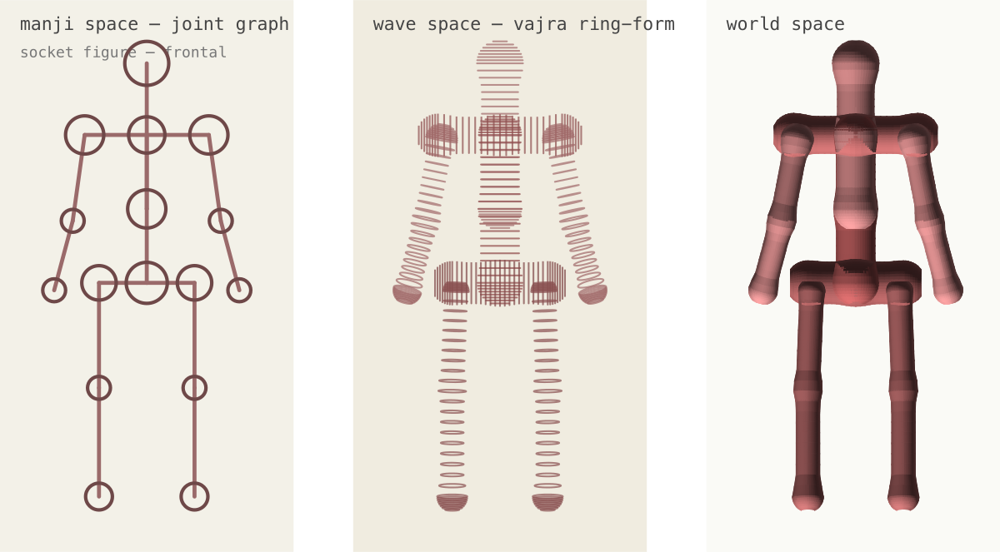
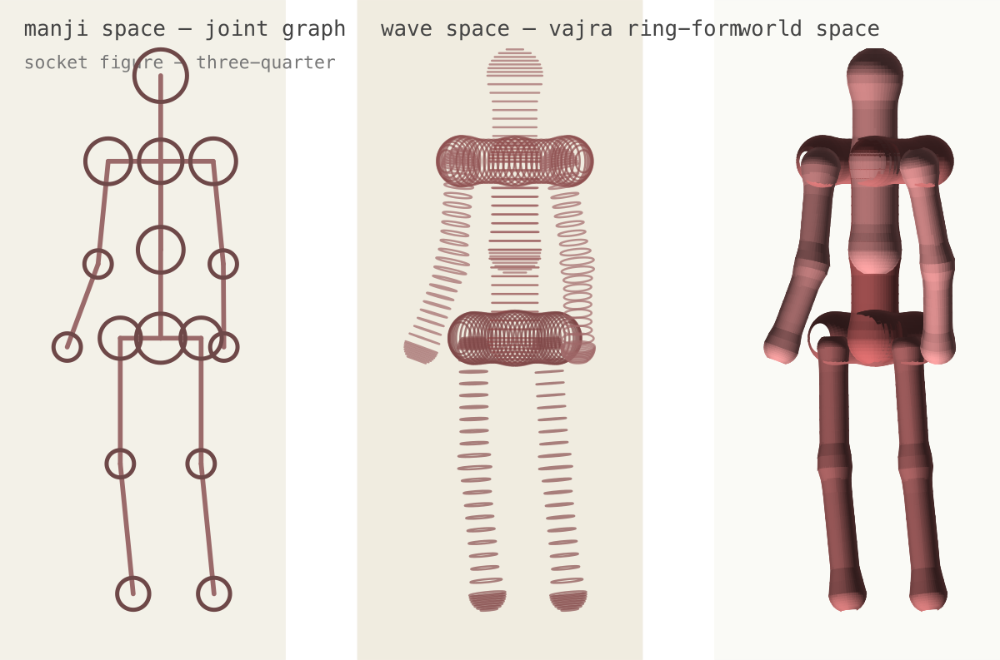
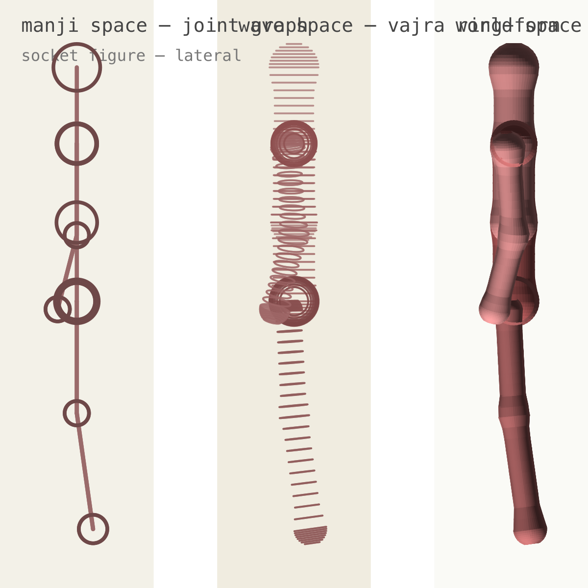
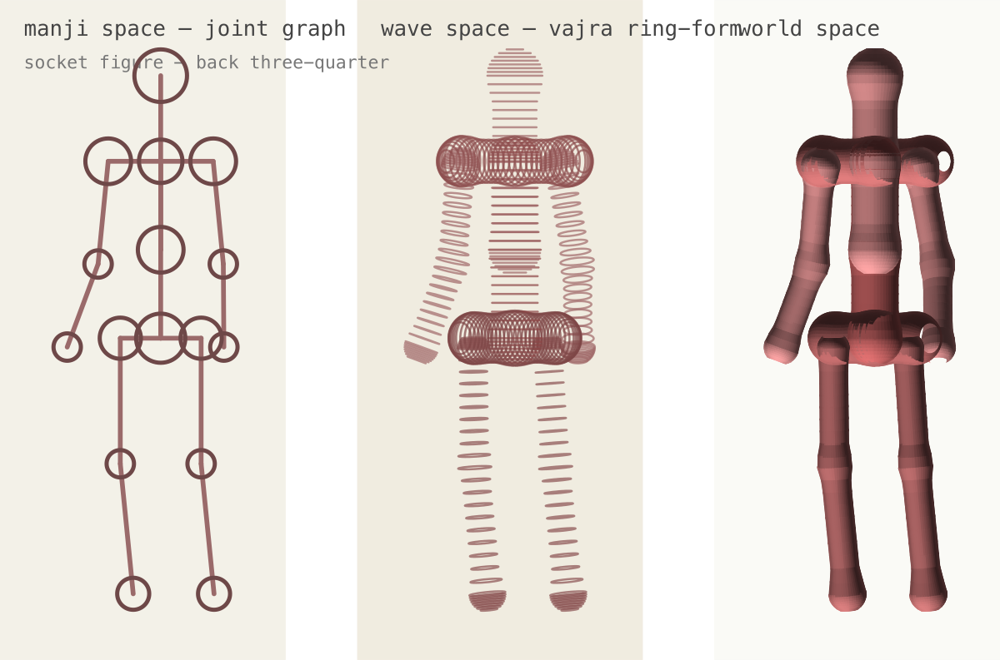
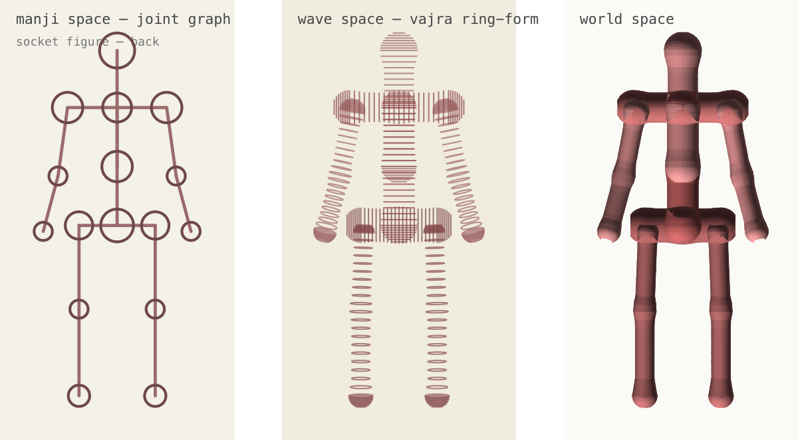

# figure-vajra — the fundamental figure shape

The empty figure skeleton, codified as one coherent primitive. It is a
**harmonized vajra graph**: a fixed set of landmark **nodes** (each a
manji point with one radius) joined by **edges** (a [vajra](POLYGONIZER-SYNTHESIS.md#the-vajra--3-point-relational-volume)
over a node triple). Module: [figure-vajra.js](../control/lib/graph/polygonizer/figure-vajra.js).

## Three manifestations of one model

The same node/edge data reads three ways — this is the figure's
mandala-space / wave-space / world-space split:

| Manifestation | What it is | API |
|---|---|---|
| **manji** | the joint graph — one sphere per node, connected by lines; the mandala-space character read | `figureJointGraph(positions)` |
| **wave** | the vajra ring-form — each edge a vajra, with anatomical ball-in-socket at the limb roots | `figureVajraSpecs(positions)` |
| **world** | the rendered surface a renderer paints from the wave specs (mesh / skin) | renderer-owned |

A renderer owns scale, the view rotation, projection, shading, and
layout. The orthographic three-panel spike
([figure-mandala-vajra-shoulder.spike.gen.test.js](../control/lib/graph/polygonizer/figure-mandala-vajra-shoulder.spike.gen.test.js))
is one such renderer.

## The graph

16 nodes, 8 edges. Joints (elbow/knee and the midline hubs neck/navel/
pelvis) are thin screws; caps and extremities are beads. Shared hubs
(`neckHub`, `navel`, `pelvisHub`, `shoulderL/R`, `hipL/R`) carry a single
radius, so edges that meet there are automatically harmonized.

- Head/neck: `headTop → neckHub → navel`
- Torso: `neckHub → navel → pelvisHub`
- Girdles: `shoulderL → neckHub → shoulderR`, `hipL → pelvisHub → hipR`
- Limbs: `shoulder/hip → elbow/knee → wrist/ankle` (ball-in-socket roots)

## Ball-in-socket (wave only)

A limb's proximal sphere is a **smaller ball seated at the socket's
limb-side edge**, offset toward the limb's aim plus a forward+medial bias
(the femoral/humeral neck angle). The girdle keeps the full-size socket
sphere. The two girdles are anatomical opposites:

- **shoulder** — large head on a shallow socket (`0.76` of the cap),
- **hip** — head sunk into a deep socket (`0.50`).

This is a wave (form) refinement only; the manji joint graph keeps the
clean joint-center mapping.

## Articulation

A kinematic model — every joint is a constrained rotation clamped to
anatomical `LIMITS`, so a pose can never exceed its range or hinge the
wrong way:

- **head/neck** — 90° swivel cone about the neck base.
- **shoulder / hip** — swivel cones carrying the limb (shoulder out-ranges
  the hip; the shoulder is the most mobile joint, the hip is limited for
  stability).
- **elbow / knee** — one-way hinges (`REF_FWD` / `REF_BACK`): the lower
  segment can only fold the natural way, never hyperextend, regardless of
  how the limb is posed.
- **core** — twist (upper vs lower against the midline) + a small fwd/back
  bend that carries the whole top/bottom.

`articulate(dof)` builds a pose from degrees-of-freedom (clamped);
`applyPose(ops)` hand-authors via rotate-about / hinge / set ops.

## Canonical reference

The locked empty-skeleton reference is the **neutral cardinal turntable** —
the relaxed neutral stand turned through the five cardinal views, each as
the three-panel manji / wave / world. These images are committed here as
the canonical record (regenerate via the renderer spike, which writes the
SVG source to the gitignored `spike-output/figure-mandala-cardinal-socket/`).

Note the **lateral** view: the figure is currently **planar** (no
anterior-posterior form yet), so side-on it reads as a thin column with
the sockets as concentric rings. Front-back *form* — chest/belly/glute
depth, a face on the head — is the next frontier and is sculpted against
this locked armature.
